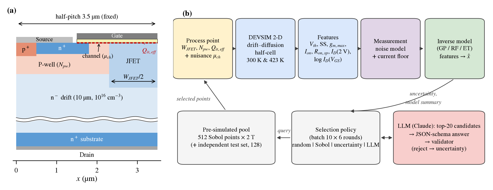
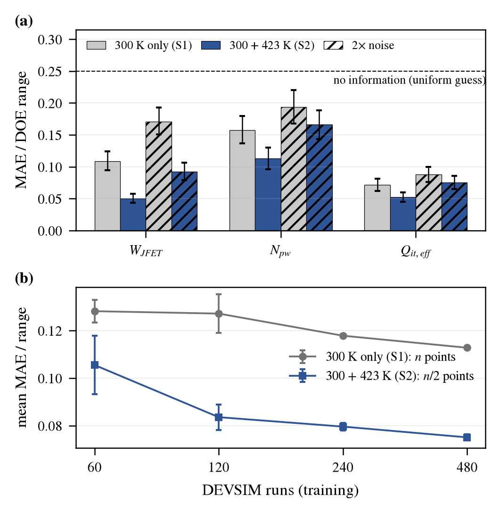

# DEVSIM 기반 4H-SiC 평판형 MOSFET 공정 결과 파라미터의 다중 온도 역추정과 LLM 보조 적응형 실험 선택

**Multi-Temperature Inverse Estimation of Process-Outcome Parameters and LLM-Assisted Adaptive Experiment Selection for 4H-SiC Planar MOSFETs Using DEVSIM**

[](https://github.com/mseokq23/sic-mosfet-devsim/actions/workflows/ci.yml)
[](LICENSE)
[](environment.txt)
[](environment.txt)
<!-- Zenodo 연동 후 DOI 배지를 여기에 추가 -->

**이민석 (Minseok Lee)** · 광운대학교 전자공학과 (Department of Electronic Engineering, Kwangwoon University) · minseok1270@gmail.com

> 학부생 학술논문의 재현용 저장소입니다. 논문에 쓰인 시뮬레이션 코드, 동결 설정, 원자료(run별 JSON), 분석 스크립트와 결과, 분석 계획 기록을 함께 제공합니다. 논문 상태: 작성 중(2026).

---

## Abstract

This repository accompanies a study that uses the open-source TCAD tool DEVSIM to estimate three latent process-outcome parameters of a 4H-SiC planar MOSFET (JFET width, P-well doping and effective interface charge) from DC characteristics simulated at 300 K and 423 K, with channel mobility varied as an unestimated nuisance parameter. With measurement noise added to the features, including the 423 K features lowered the normalized error of a Gaussian-process inverse model from 0.112 to 0.072 (36%), and a linear ridge model gave a similar reduction. When the 423 K data were re-simulated with channel-mobility temperature exponents of 0 and −1 and the model was trained with the same exponent, the reduction was 35% and 32%; a model trained with the nominal exponent, however, gave errors of 0.54 and 0.93 on these data. In a post-hoc analysis, training on randomly mixed physics assumptions kept a 22–29% reduction. Uncertainty sampling needed 12–20% fewer simulations than random sampling, similar to a Sobol sequence, and an LLM-assisted selector filtered by a deterministic validator was not better than uncertainty sampling.

## 국문 요약

공개형 TCAD인 DEVSIM으로 4H-SiC 평판형 MOSFET의 300 K·423 K DC 특성을 계산하고, 이 특성으로 JFET 폭, P-well 도핑, 유효 계면전하를 역추정하였다. 특징에 측정 잡음을 넣었을 때 423 K 특징을 함께 쓰면 가우시안 과정 역추정의 정규화 오차가 0.112에서 0.072로 줄었고, 선형 Ridge 모델에서도 비슷하게 줄었다. 423 K 데이터를 채널 이동도 온도지수 0과 −1로 다시 계산해 같은 지수로 학습·평가하면 오차 감소율은 35%와 32%였으나, 기준 지수(+1)로 학습한 모델을 이 데이터에 적용하면 오차가 0.537과 0.928로 300 K만 쓴 모델(0.112)보다 컸다. 다섯 가지 물리 가정을 섞어 학습한 사후 분석에서는 '22~29%의 감소'가 유지되었다. 불확실도 기반 선택은 무작위보다 시뮬레이션을 '12~20%' 줄였으나 Sobol 순서와 비슷하였고, 결정론적 검증기로 출력을 거른 LLM 보조 선택은 불확실도 선택보다 낫지 않았다.

<p align="center">
  
</p>
<p align="center"><sub><b>논문 그림 1.</b> (a) 4H-SiC 평판형 MOSFET half-cell 단면과 추정 파라미터, (b) 다중 온도 시뮬레이션–특징 추출–역추정–표본 선택 흐름</sub></p>

## 목차

[연구 질문](#연구-질문) · [주요 결과](#주요-결과) · [방법 요약](#방법-요약) · [모델 검증](#모델-검증) · [재현 수준](#재현-수준) · [빠른 시작](#빠른-시작) · [결과 재분석](#결과-재분석) · [TCAD 재계산](#tcad-재계산) · [논문–산출물 대응표](#논문산출물-대응표) · [데이터 구조](#데이터-구조) · [분석 계획과 예측 대조](#분석-계획과-예측-대조) · [타당성에 대한 위협](#타당성에-대한-위협) · [실행 기록](#실행-기록) · [LLM 사용 범위](#llm-사용-범위) · [저장소 구조](#저장소-구조) · [인용](#인용)

## 연구 질문

| 구분 | 질문 |
|---|---|
| RQ1 | 300 K 특성에 423 K 특성을 더하면 공정 결과 파라미터의 역추정 오차가 얼마나 줄고, 그 감소가 423 K 물리 가정에 따라 어떻게 달라지는가? |
| RQ2 | 불확실도·거리 기반 적응형 표본 선택이 무작위·Sobol 표본보다 필요한 TCAD 실행 수를 줄이는가? |
| RQ3 | 결정론적 검증기로 출력을 거른 LLM 보조 선택이 수치적 불확실도 선택보다 나은가? (귀무가설: 차이 없음) |

## 주요 결과

기본 잡음, 가우시안 과정(GP) 역추정, 독립 시험점 128개 기준입니다. MAE<sub>norm</sub>은 세 파라미터의 절대오차를 각 DOE 범위로 나눠 평균한 값이며, 괄호의 CI는 시험점 짝지은 부트스트랩(5,000회) 95% 신뢰구간입니다.

| 분석 | 결과 | 근거 파일 |
|---|---|---|
| RQ1: 300 K(S1) 대 300+423 K(S2) | MAE<sub>norm</sub> 0.112 → 0.072 (−36%), S2−S1 [−0.049, −0.031]; W<sub>JFET</sub> −53%, N<sub>pw</sub> −28%, Q<sub>it,eff</sub> −27% | [`rq1.md`](results/summary/rq1.md), [`robustness.json`](results/summary/robustness.json) |
| RQ1: 같은 DEVSIM 실행 수 | 120 run에서 S2(60점) 0.084, S1은 480 run에서도 0.113 | [`rq1_equal_budget.md`](results/summary/rq1_equal_budget.md) |
| RQ1: 선형 Ridge | S1 0.117 → S2 0.073 | [`ridge_rq1.json`](results/summary/ridge_rq1.json) |
| 같은 물리로 학습: 이동도 지수 γ = 0, −1 | S2 0.073, 0.076 (S1 대비 −35%, −32%, CI 모두 0 미만) | [`robustness.md`](results/summary/robustness.md) |
| 같은 물리로 학습: 계면전하 감소 r = 0.1, 0.3 | S2 0.057, 0.033 (423 K V<sub>th</sub>가 Q<sub>it,eff</sub>에 비례해 추가 이동) | [`robustness.md`](results/summary/robustness.md) |
| 기준 물리(γ = +1, r = 0)로 학습한 모델 | γ = 0: 0.537, γ = −1: 0.928, r = 0.3: 0.132 (S1 0.112) | [`robustness.md`](results/summary/robustness.md) |
| 가정 무작위화 학습 (사후 분석) | 다섯 시험 모두 S2 0.079~0.088 (S1 대비 −22~29%) | [`robustness_mixed.md`](results/summary/robustness_mixed.md) |
| 기생 직렬저항 (탐색적, 시험 데이터에만 적용) | S1 0.378, S2 0.261 | [`robustness.md`](results/summary/robustness.md) |
| RQ2: 불확실도 선택 | 무작위 대비 최종 −0.0025 [−0.0039, −0.0009], 약 12% 절감(초기 30점이면 약 20%), Sobol 순서(−0.0023)와 비슷 | [`rq2.md`](results/summary/rq2.md), [`al_ninit_summary.csv`](results/summary/al_ninit_summary.csv) |
| RQ3: LLM 보조 선택 | 60회 중 59회 검증 통과, 최종 0.1250 대 불확실도 0.1238, 차이 +0.0012 [−0.0008, +0.0035] | [`rq3.md`](results/summary/rq3.md), [`llm_calls.jsonl`](results/al_live/nominal/llm_calls.jsonl) |

<p align="center">
  
</p>
<p align="center"><sub><b>논문 그림 3.</b> (a) S1 대비 S2의 파라미터별 오차(기본·2배 잡음), (b) 같은 DEVSIM 실행 수에서의 비교</sub></p>

## 방법 요약

### 소자와 물리 모델

| 항목 | 설정 |
|---|---|
| 구조 | 1.2 kV급 설계를 참고한 2차원 평판형 half-cell (half-pitch 3.5 µm, 채널 길이 0.5 µm, 게이트 산화막 50 nm) |
| 도핑 | P-well 1×10<sup>17</sup>, JFET 2×10<sup>16</sup>, 드리프트 10 µm·1×10<sup>16</sup> cm<sup>−3</sup> |
| 수송 | Poisson + 전자 연속방정식(Scharfetter–Gummel), 정공은 소스/바디와 평형인 단극성 근사 |
| 물리 | 불완전 이온화(N 66 meV, Al 191 meV), 도핑·온도 의존 이동도, SRH 재결합, 정적 계면전하 |
| 메시·정밀도 | medium 메시(약 1.1만 노드), 배정밀도, 상대 허용오차 10<sup>−6</sup> |
| 제외 | 충돌 이온화, 자기발열, 산화막 열화, Fermi–Dirac 통계, 전계 의존 이동도, 동적 계면 트랩 |

채널 이동도와 계면전하는 다음과 같이 두었습니다. 기준 모델은 γ = +1, r = 0이며, 나머지 값은 강건성 시험에만 씁니다.

$$
\mu_n^{-1} = \mu_{\mathrm{bulk}}^{-1}(N,T) + e^{-y/\lambda}\,\mu_{\mathrm{surf}}^{-1}(T),\qquad
\mu_{\mathrm{surf}}(T) = 20\,s_\mu\left(\frac{T}{300\ \mathrm{K}}\right)^{\gamma}\ \mathrm{cm^2/(V\,s)},\quad \gamma\in\{+1,0,-1\}
$$

$$
\sigma_{\mathrm{int}} = q\left[Q_f + Q_{\mathrm{it,eff}}(T)\right],\qquad
Q_{\mathrm{it,eff}}(T) = Q_{\mathrm{it,eff}}(300\ \mathrm{K})\left[1 - r\,\frac{T-300\ \mathrm{K}}{123\ \mathrm{K}}\right],\quad r\in\{0,\,0.1,\,0.3\}
$$

여기서 λ = 3 nm, Q<sub>f</sub> = 1×10<sup>12</sup> cm<sup>−2</sup>(고정)입니다. 추정 대상은 300 K에서 정의한 Q<sub>it,eff</sub>이고, γ와 r은 역추정 모델에 입력하지 않습니다.

### 추정 파라미터, 특징, 잡음

| 변수 | 범위 | 역할 |
|---|---|---|
| W<sub>JFET</sub> 배율 | 0.8–1.2 (마스크 피치 고정, 자기정렬 경계 이동) | 추정 대상 |
| N<sub>pw</sub> 배율 | 0.8–1.2 | 추정 대상 |
| Q<sub>it,eff</sub> | −1.5 ~ −0.5 ×10<sup>12</sup> cm<sup>−2</sup> | 추정 대상 |
| s<sub>μ</sub> (채널 이동도 배율) | 0.8–1.2 | 교란 변수(추정하지 않음) |

- **특징(온도당 17개):** 스칼라 6개(V<sub>th</sub>(1×10<sup>−4</sup> A/cm 정전류), SS, log g<sub>m,max</sub>, log I<sub>on</sub>, log R<sub>on,sp</sub>, log I<sub>D</sub>(V<sub>DS</sub> = 2 V))와 전달곡선 표본 11개(V<sub>GS</sub> = 4, 5, 6, 7, 8, 10, …, 20 V의 log I<sub>D</sub>).
- **특징 집합:** S1 = 300 K(17차원), S2 = 300+423 K(34차원), S3 = S2 + 온도 차분(51차원).
- **측정 잡음(특징 단계, 서로 독립):** V<sub>th</sub> 10 mV, SS·g<sub>m,max</sub> 2%, I<sub>on</sub>·R<sub>on,sp</sub>·I<sub>D</sub>(2 V) 1%, 전달곡선 표본 2%. 표본 전류는 잡음 후 1×10<sup>−11</sup> A/cm에서 절단합니다. 풀과 시험 집합에는 서로 다른 고정 시드를 씁니다([`noise_model.yaml`](configs/noise_model.yaml)).

$$
\mathrm{MAE_{norm}} = \frac{1}{3}\sum_{j=1}^{3}\frac{1}{N}\sum_{i=1}^{N}\frac{\lvert\hat\theta_{ij}-\theta_{ij}\rvert}{\theta_j^{\max}-\theta_j^{\min}}
$$

### 실험 설계

- **명목 데이터:** 4차원 Sobol 풀 512점, 독립 무작위 시험점 128점, 각 300/423 K (1,280 run).
- **역추정 모델:** GP(상수×RBF + 백색잡음), 랜덤 포레스트, extra trees, Ridge.
- **능동학습:** 초기 무작위 60점 + 10점 × 6라운드, 시드 10개. 불확실도 정책은 순방향 RF(200그루) 트리 간 표준편차 u(p)와 학습점까지의 최소 거리 d로 다음을 순차 선택합니다.

$$
p^{*} = \arg\max_{p}\; u(p)\, d(p,\ \mathcal{D}\cup\mathcal{B})
$$

- **강건성 시험:** 423 K만 다시 계산(γ = 0, −1; r = 0.1, 0.3; 2,560 run). ① 같은 물리로 학습·평가, ② 기준 물리로 학습하고 변형 물리로 평가, ③ 512점을 다섯 가정에 균등 무작위 배정한 가정 무작위화 학습(사후 분석, 가정 종류는 입력하지 않음)으로 나눕니다.
- **기생 직렬저항(탐색적):** 소자별 ρ<sub>s</sub> ~ U(0.1, 0.3) mΩ·cm<sup>2</sup>를 드레인 측 집중저항으로 두고 저장 곡선을 1차 근사로 변환합니다.

$$
I_{D,\mathrm{ext}} = \frac{I_D}{1 + I_D R_s / V_{DS}},\qquad I_{D,\mathrm{ext}} = f\!\left(V_{DS} - I_{D,\mathrm{ext}} R_s\right),\qquad R_s = \rho_s / W
$$

## 모델 검증

| 단계 | 내용 | 판정 기준 | 결과 | 기록 |
|---|---|---|---|---|
| Gate 0 | DEVSIM 2.11.0 + MKL, 공식 1D diode 예제 2회 실행 | 출력 동일 | PASS (CI에서 매 push마다 확인) | [`gate0_check.py`](scripts/gate0_check.py) |
| Gate 1 | 1D 4H-SiC PN 다이오드, 300/423 K | 해석해 | 내장전위 소수점 넷째 자리까지 일치, 공핍폭 1.5% 이내 | [`gate1_pn_diode.json`](results/pretest/gate1_pn_diode.json) |
| Gate 2 | 1D MOS 커패시터 | 평탄대 전압 해석해 | 오차 ≤ 5 mV, ±10<sup>12</sup> cm<sup>−2</sup> 전하에 ΔV<sub>fb</sub> ≈ ∓2.32 V(이론 ∓2.320 V) | [`gate2_moscap.json`](results/pretest/gate2_moscap.json) |
| Gate 3 | 2D MOSFET half-cell (300 K) | [`sweep_protocol.yaml`](configs/sweep_protocol.yaml) 허용오차 | medium 대 fine: V<sub>th</sub> 0.07 mV, SS 0.1%, g<sub>m</sub> 2.7%, I<sub>on</sub>·R<sub>on</sub> 0.9%; 배정밀도 대 128비트 V<sub>th</sub> 2×10<sup>−11</sup> V; 2회 실행 비트 단위 동일 | [`gate3_summary.json`](results/pretest/gate3_summary.json) |
| 풀 감사 | 해석 기울기 dV<sub>th</sub>/dQ<sub>it</sub> | −q/C<sub>ox</sub> | −2.32005 V (이론 −2.319888 V, 10<sup>12</sup> cm<sup>−2</sup>당) | [`AUDIT.md`](docs/AUDIT.md) |

Gate 3 메시 시험은 동결 전 설정에서 300 K로 수행했습니다. v1.1에서 바뀐 이동도 온도지수는 300 K 결과에 영향을 주지 않고, 고정 피치 W<sub>JFET</sub> 정의는 기준 배율(1.0)에서 구조가 같습니다. v1.1 기준 소자는 300 K→423 K에서 V<sub>th</sub> 3.765→3.530 V, SS 112.5→155.7 mV/dec, R<sub>on,sp</sub> 2.00→2.87 mΩ·cm<sup>2</sup>입니다([`stage_a_v11`](results/stage_a_v11/)).

## 재현 수준

| 수준 | 내용 | 필요 자원 | 시작점 |
|---|---|---|---|
| L0 | 저장된 결과·감사 문서 확인 | 브라우저 | [`results/summary/`](results/summary/), [`docs/`](docs/) |
| L1 | 저장된 원자료에서 모든 표·그림 수치 재계산 (DEVSIM 계산 없음) | Python 환경, 수 분~수십 분 | [결과 재분석](#결과-재분석) |
| L2 | 소자 수준 검증(Gate 0–3)과 일부 run 재시뮬레이션 | DEVSIM + MKL, 수십 분 | [TCAD 재계산](#tcad-재계산) |
| L3 | 전체 DOE 재계산(명목 1,280 + 강건성 2,560 run) | 약 50 코어·시간 (GitHub Actions 병렬 권장) | [TCAD 재계산](#tcad-재계산) |

RQ3의 실제 LLM 호출은 API 키와 비용이 필요하고 응답이 비트 단위로 재현되지 않으므로, 논문 결과의 기준 기록은 저장된 [`llm_calls.jsonl`](results/al_live/nominal/llm_calls.jsonl)입니다.

## 빠른 시작

### GitHub Codespaces

1. **Code → Codespaces → Create codespace** (4-core 권장).
2. `postCreate`가 의존성 설치(MKL 포함), editable 설치, Gate 0 점검, 환경 기록을 수행합니다.
3. 다음을 실행합니다.

```bash
pytest -q
python scripts/gate0_check.py
```

### 로컬 Linux

```bash
git clone https://github.com/mseokq23/sic-mosfet-devsim.git
cd sic-mosfet-devsim
python3.12 -m venv .venv && source .venv/bin/activate
pip install -r requirements.txt && pip install -e .
export MKL_NUM_THREADS=1 OMP_NUM_THREADS=1
pytest -q
python scripts/gate0_check.py
```

DEVSIM은 MKL이 없으면 import에 실패합니다. 검증에 쓴 정확한 패키지 버전은 [`environment.txt`](environment.txt)에 있습니다. CI 배지는 단위 시험과 Gate 0의 상태이며, 전체 DOE의 자동 재현을 뜻하지 않습니다.

## 결과 재분석

저장된 원자료에서 논문의 표·그림 수치를 다시 계산합니다(L1). 스크립트가 기존 요약 파일을 덮어쓰므로 깨끗한 clone이나 별도 branch에서 실행하는 것을 권장합니다.

```bash
python scripts/audit_results.py results/pool configs/design_pool.csv results/test configs/design_test.csv
python scripts/summarize_results.py      # RQ1, 같은 실행 수 비교, RQ2, RQ3 요약과 그림
python scripts/ridge_rq1.py              # Ridge 기준선
python scripts/al_ninit.py --n-init 30 90 --seeds 10   # 초기 표본 수 민감도
python scripts/robustness.py             # 이동도 지수·계면전하·직렬저항 시험
python scripts/robustness_mixed.py       # 가정 무작위화 학습(사후), 논문 표 2
python scripts/make_paper_figures.py     # 논문 그림
```

| 출력 | 생성 스크립트 |
|---|---|
| `results/pool/audit.json` | `audit_results.py` |
| `results/summary/rq1.md`, `rq1_equal_budget.md`, `rq2.md`, `rq3.md`, `fig_*.png` | `summarize_results.py` |
| `results/summary/ridge_rq1.json` | `ridge_rq1.py` |
| `results/summary/al_ninit_*.csv` | `al_ninit.py` |
| `results/summary/robustness.json`, `robustness.md` | `robustness.py` |
| `results/summary/robustness_mixed.*`, `paper/tables/table2_robustness.*` | `robustness_mixed.py` |
| `paper/figures/fig1–4.{png,pdf}`, `paper/tables/table1_*` | `make_paper_figures.py` |

같은 코드와 원자료에서는 같은 값이 나와야 합니다. 예를 들어 `robustness.py`의 기준 결과는 S1 0.112275, S2 0.072011입니다.

## TCAD 재계산

### 소자 수준 검증 (L2)

```bash
python scripts/gate1_pn_diode.py
python scripts/gate2_moscap.py
python scripts/gate3_mosfet.py && python scripts/gate3_report.py
```

### 명목 DOE (L3)

```bash
python -m sicsim.runner configs/design_pool.csv --out results/pool --jobs 4 --budget-s 20000
python -m sicsim.runner configs/design_test.csv --out results/test --jobs 4
```

러너는 run마다 JSON을 즉시 저장하므로 같은 명령으로 중단 지점부터 이어서 계산합니다. 논문의 명목 데이터는 GitHub Actions의 `doe-batch` 워크플로로 계산했습니다(pool run `37091586917`, test run `37091765653`).

### 강건성 DOE (L3)

**Actions → robustness-batch → Run workflow**를 실행하면 네 변형(`gamma0`, `gamma_m1`, `qitT10`, `qitT30`)의 423 K 결과를 shard로 나눠 계산하고, 병합·분석·커밋까지 수행합니다. 300 K 결과는 물리가 같으므로 명목 데이터를 재사용합니다. 논문에 쓴 실행은 run `37164222148`입니다.

## 논문–산출물 대응표

| 논문 항목 | 입력 | 코드 | 결과 |
|---|---|---|---|
| 그림 2 (모델 검증) | `results/pretest/`, `results/stage_a_v11/` | `scripts/gate1_pn_diode.py`, `gate2_moscap.py`, `gate3_mosfet.py`, `gate3_report.py`, `make_paper_figures.py` | `results/pretest/*.json`, `paper/figures/fig2_*` |
| 표 1 (민감도), 국소 식별성 | `results/stage_a_v11/` | `scripts/stage_a_report.py`, `scripts/identifiability.py` | `stage_a_deltas.csv`, `identifiability_nominal.json`, `paper/tables/table1_*` |
| 그림 3 (RQ1) | `results/pool/`, `results/test/` | `scripts/run_al.py`, `scripts/summarize_results.py` | `results/summary/rq1*.md`, `paper/figures/fig3_*` |
| RQ1 Ridge 기준선 | 같은 원자료 | `scripts/ridge_rq1.py` | `results/summary/ridge_rq1.json` |
| 표 2 (강건성) | `results/pool_*`, `results/test_*` | `scripts/robustness.py`, `scripts/robustness_mixed.py` | `results/summary/robustness*.{json,md}`, `paper/tables/table2_*` |
| 그림 4 (RQ2·RQ3) | `results/al/`, `results/al_live/nominal/` | `scripts/run_al.py`, `scripts/al_ninit.py` | `results/summary/rq2.md`, `rq3.md`, `paper/figures/fig4_*` |
| 결과 감사 | 명목 원자료, 설계 CSV | `scripts/audit_results.py` | `docs/AUDIT.md`, `results/pool/audit.json` |
| 원고 | 위 결과 | `paper/final/build_final.js` | `paper/final/*.docx` |

## 데이터 구조

`results/<set>/runs/<run_id>.json`이 원자료이고, `runs.csv`는 이를 평탄화한 표입니다. 전류는 2차원 half-cell의 단위 깊이당 값(A/cm)이며, 면적 정규화에는 half-cell 폭(`width_cm`)을 씁니다.

| 그룹 | 필드 | 설명 |
|---|---|---|
| 식별 | `run_id`, `candidate_id`, `process_group_id`, `temperature_K` | 설계점과 온도 |
| 설계 변수 | `wjfet_scale`, `npwell_scale`, `qit_eff_cm2`, `mu_channel_scale` | 시뮬레이터 입력(Q<sub>it,eff</sub>는 300 K 기준값) |
| 출처 | `config_version`, `physics_hash`, `solver_hash`, `mesh_hash`, `code_commit`, `created_at`, `env` | 설정·물리·코드 버전 |
| 수치 이력 | `converged`, `retry_count`, `n_solves`, `n_fail`, `n_nodes`, `runtime_s` | 수렴과 계산 비용 |
| 곡선 | `curves.transfer` (V<sub>DS</sub> = 0.1 V), `curves.output` (V<sub>GS</sub> = 18 V) | 원시 I–V |
| 특징 | `vth_V`, `ss_mV_dec`, `gm_max_S_per_cm`, `ion_A_per_cm`, `ron_mohm_cm2`, `id_vds_req_A_per_cm`, `logid_vg4`–`logid_vg20` | 역추정 입력 |
| 품질 표시 | `refined`, `ss_window_resolved`, `vds_reached_V`, `kcl_floor_A_per_cm` | 추출 조건 확인 |

계면전하 변형(`qitT10`, `qitT30`)의 run에는 423 K에서 실제로 적용한 값 `qit_eff_at_T_cm2`가 추가로 기록됩니다.

## 분석 계획과 예측 대조

| 분석 | 분류 | 기록 |
|---|---|---|
| 명목 RQ1–RQ3 예측, 전류 하한 규칙(noise-v1.1) | 풀·시험 시뮬레이션 후, 분석 전에 기록 | [`PREDICTIONS.md`](docs/PREDICTIONS.md) (커밋 `f542405`) |
| 이동도 지수·계면전하 변형 | 변형 시뮬레이션 전에 기록 | [`PREDICTIONS_ROBUSTNESS.md`](docs/PREDICTIONS_ROBUSTNESS.md) (커밋 `ae73669`) |
| 기생 직렬저항 | 탐색적 분석(코드 검증 중 먼저 계산되어 예측 대상이 아님을 명시) | 같은 문서 |
| 가정 무작위화 학습 | 결과 확인 후 수행한 사후 분석 | [`ROBUSTNESS_RESULTS.md`](docs/ROBUSTNESS_RESULTS.md) |

**예측과 결과의 차이.** 같은 물리에서 S2가 우세하리라는 예측(R1)은 맞았습니다. 기준 물리로 학습한 S2가 γ = 0 시험에서도 S1보다 나으리라는 예측(R3)은 틀렸으며, 실제 오차는 S1의 약 5배였습니다. 계면전하 변형에서 N<sub>pw</sub> 개선이 줄어들 수 있다는 방향 예측(R2)도 빗나갔습니다. 전체 대조는 [`ROBUSTNESS_RESULTS.md`](docs/ROBUSTNESS_RESULTS.md)에 있습니다.

Git 커밋은 계획과 결과의 시간 순서를 보여 주지만, OSF 같은 독립 기관의 사전 등록과는 다릅니다. 이 저장소에서는 "실행 또는 분석 전에 커밋된 분석 계획"이라고 표현합니다.

## 타당성에 대한 위협

- **내적 타당성.** 300 K V<sub>th</sub> 추출의 할선 반복 오차가 최대 약 3 mV이고, 0.25 V 게이트 격자 때문에 g<sub>m,max</sub> 분해능은 약 1.3%입니다. 둘 다 가정한 측정 잡음보다 작습니다. 일부 고문턱 소자의 V<sub>GS</sub> = 4 V 전류는 수치 바닥 아래여서 1×10<sup>−11</sup> A/cm로 절단합니다.
- **통계적 결론 타당성.** 잡음은 집합마다 한 번만 실현했으므로 CI는 시험점 표본 변동만 반영합니다. 능동학습 정책 간 차이(10<sup>−3</sup> 수준)는 시드 간 변동과 비슷합니다.
- **구성 타당성.** Q<sub>it,eff</sub>는 계면 트랩 밀도(D<sub>it</sub>)가 아닌 유효 정적 전하이고, 추정 대상은 공정 조건(주입량·마스크)이 아니라 공정 결과 파라미터입니다.
- **외적 타당성.** 결과는 단극성 2차원 half-cell 한 구조와 두 온도, 가정한 잡음 모델에서 얻었고, 실측 곡선으로는 검증하지 않았습니다. 고온 물리가 학습과 다르면 오차가 크게 늘어나므로(위 표), 실측에 적용하려면 고온 물리 보정과 직렬저항 보정이 먼저 필요합니다. `1.2 kV급`은 참고 구조의 등급이며 항복전압은 계산하지 않았습니다.

## 실행 기록

| 시각 (UTC) | 식별자 | 내용 |
|---|---|---|
| 2026-10-03 02:13 | tag `v1.1-frozen` (`90dc2e5`) | 고정 피치 W<sub>JFET</sub> 정의와 명목 물리·DOE 동결 |
| 2026-10-03 04:03 / 04:16 | `d61af2c` / `728d50e` | 시험·풀 결과(Actions run `37091765653` / `37091586917`) |
| 2026-10-03 05:05 | `f542405` | 결과 감사, 전류 하한 규칙, RQ1–RQ3 예측 기록 |
| 2026-10-03 05:23 | `80f7af0` | RQ1–RQ3 결과 |
| 2026-10-03 05:41 / 06:12 | `faf8b02` / `8709fdc` | RQ3 실제 LLM 실행 결과 |
| 2026-10-03 23:59 | `ae73669` | 강건성 변형 설정과 예측 기록 |
| 2026-10-04 01:16 | `c83ea19` | 강건성 결과(Actions run `37164222148`, 2,560 run) |

이후 커밋은 분석 문서, 원고, CI 설정을 바꾸었으며 시뮬레이션 코드(`src/`)와 설정(`configs/`)은 바꾸지 않았습니다. 현재 코드로 재계산한 물리·솔버 해시와 기준 결과는 저장된 값과 같습니다.

## LLM 사용 범위

- **역할.** LLM(Claude, `claude-sonnet-5-5`)은 DEVSIM을 실행하지 않습니다. 매 라운드 불확실도 상위 20개 후보의 정규화된 설계값·불확실도·학습점 거리와 교차검증 오차를 받아 10개를 고릅니다.
- **검증.** 출력은 JSON 스키마 구조화 출력으로 받고, Pydantic 검증 함수가 후보 포함 여부, 중복, 개수(10개), 근거 길이(400자 이하)를 확인합니다. 하나라도 어기면 그 라운드는 불확실도 정책의 선택을 씁니다(60회 중 1회).
- **기록.** 호출마다 모델 ID, 프롬프트·입력 해시, 응답, 검증 결과, 토큰 수를 [`llm_calls.jsonl`](results/al_live/nominal/llm_calls.jsonl)에 남겼습니다(입력 약 18만, 출력 약 4만 토큰, 평균 6.3 s).
- **실행.** API 키는 `ANTHROPIC_API_KEY`(또는 Codespaces secret `MSEOKQ_CLAUDE`)로 읽습니다([`.env.example`](.env.example)). 키가 없거나 재시도 후에도 호출이 실패하면 dry-run으로 넘어가지 않고 실행을 멈춥니다.

```bash
python scripts/llm_check.py   # 호출 1회로 키와 모델 확인
python scripts/run_al.py --pool results/pool --test results/test --seeds 10 \
  --noise nominal --policies llm --llm-live --out results/al_live
```

## 저장소 구조

```text
.github/workflows/   ci.yml(단위 시험·Gate 0), doe-batch.yml(명목 DOE), robustness-batch.yml(강건성 DOE)
configs/             baseline.yaml(v1.1-frozen), parameter_bounds.yaml, noise_model.yaml,
                     sweep_protocol.yaml, design_*.csv, variants/(강건성 물리 변형)
src/sicsim/          params·physics(DEVSIM 모델), devices(1D/2D 구조), solver·simulate(단일 run),
                     extract(특징), runner·worker(격리·병렬·재개·shard), design(DOE),
                     analysis·alsim(역추정·정책 비교), robust(강건성 평가), schema·llm(검증·LLM 기록)
scripts/             Gate 0–3, DOE 병합, 감사, RQ 분석, 강건성 분석, 그림 생성
results/             pretest/, stage_a_v11/, pool/, test/, pool_*/, test_*/, al/, al_live/, summary/
paper/               figures/, tables/, captions.md, final/(원고 빌드 스크립트·docx)
docs/                PREDICTIONS*.md, AUDIT.md, ROBUSTNESS*.md, PRETEST.md, ROADMAP.md
tests/               단위·파이프라인 시험
```

## 환경과 계산량

- Python 3.12, DEVSIM 2.11.0, MKL 2026.1.0, NumPy 2.5.3, scikit-learn 1.9.1 (전체 목록: [`environment.txt`](environment.txt), [`requirements.txt`](requirements.txt))
- 실행 환경: GitHub-hosted Ubuntu runner, GitHub Codespaces (4-core)
- 모든 run은 `MKL_NUM_THREADS=1`, `OMP_NUM_THREADS=1`로 실행합니다. 같은 환경에서는 결과가 비트 단위로 같고, 다른 CPU에서는 곡선 일부 점에 10<sup>−13</sup> 수준의 반올림 차이가 생길 수 있습니다.
- run당 계산 시간: GitHub Actions 중앙값 45–49 s, Codespaces 약 80 s(1코어). 명목 DOE는 약 16 코어·시간, 강건성 DOE는 약 33 코어·시간입니다.

## 인용

이 저장소를 인용하려면 GitHub의 **Cite this repository**(아래 [`CITATION.cff`](CITATION.cff) 기반)를 쓰거나 다음 BibTeX를 사용하십시오. 논문이 게재되면 학회명·권호·쪽수와 DOI를 추가합니다.

```bibtex
@software{lee2026sicmosfetdevsim,
  author  = {Lee, Minseok},
  title   = {sic-mosfet-devsim: DEVSIM-based multi-temperature inverse estimation of process-outcome parameters in 4H-SiC planar MOSFETs},
  year    = {2026},
  version = {1.4a},
  url     = {https://github.com/mseokq23/sic-mosfet-devsim},
  license = {MIT}
}
```

## 라이선스

코드는 [MIT License](LICENSE)를 따릅니다. DEVSIM 등 외부 소프트웨어와 데이터시트·문헌 자료는 각 저작권자의 조건을 따릅니다.

## AI 도구 사용 고지

<!-- 학회 규정에 맞게 수정하거나 삭제하십시오. -->
코드 작성, 분석 스크립트 정리, 문서·원고 초안 작성에 대화형 AI 도구(Anthropic Claude)를 보조적으로 사용하였습니다. 연구 질문과 설계의 결정, 시뮬레이션 실행, 결과 확인은 저자가 수행하였습니다. RQ3에서 연구 대상으로 사용한 Claude API 호출은 위 [LLM 사용 범위](#llm-사용-범위)에 별도로 기록되어 있습니다.

## 문의

이민석 · minseok1270@gmail.com · 질문이나 재현 문제는 [Issues](https://github.com/mseokq23/sic-mosfet-devsim/issues)에 남겨 주십시오.
