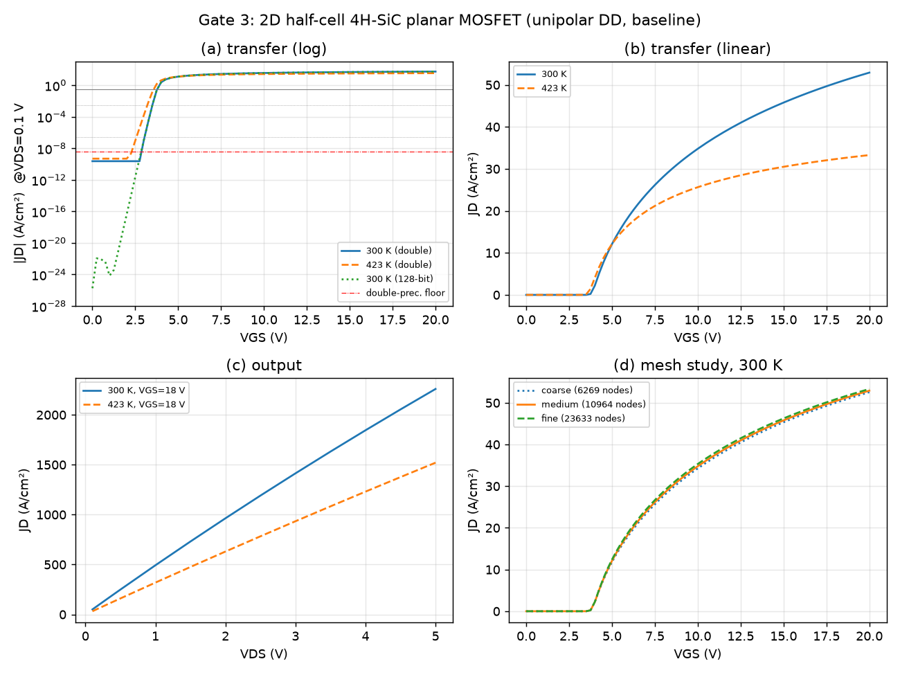
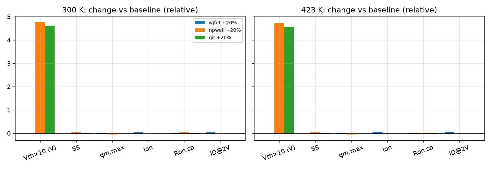

# 사전 테스트 결과 (pre-test)

실행: 2026-10-02, 샌드박스(Python 3.12.3, 1 CPU, 3 GB), devsim 2.11.0 + mkl 2026.1.0(PARDISO). 원자료: `results/pretest/` (run별 JSON에 곡선·수치 이력 포함). 이 문서는 `scripts/make_pretest_report.py`로 생성.

## 요약

| 단계 | 내용 | 결과 | 판정 |
|---|---|---|---|
| G0 | 설치·공식 예제 | `pip install devsim` 단독은 import 실패(BLAS/LAPACK 없음) → mkl 추가로 해결. 공식 diode_1d 0.36 s, 2회 비트 동일 | 통과 |
| G1 | 1D PN 다이오드 | Vbi = 해석해(300 K 2.8817/2.9547 V, 423 K 2.7162/2.7734 V; 불완전이온화 on/off), Al 1e18 이온화율 6.0%→20.9%(300→423 K) 해석해 일치, 공핍폭 오차 1.3%, 이상계수 ~2→~1.1 | 통과 |
| G2 | 1D MOSCAP | Vfb 오차 ≤5 mV, ΔVfb(Qeff ±1e12) ∓2.318~2.322 V vs 이론 ∓2.320 V, Vth 오차 0~28 mV(공핍근사 대비) | 통과 |
| G3 | 2D half-cell MOSFET | medium 메시 채택(사전 허용오차 전부 통과), 배정밀도=128-bit 특징, 비트 단위 재현, 온도 방향 타당 | 통과 |
| Stage A | ±20% OAT × 300/423 K | 14/14 수렴, 사전 예상 부호 20/22 일치 | 조건부: 보정 추출로 재실행 필요 |

## G3: 2D MOSFET (기준 소자, 300 K, 배정밀도, 단극성 DD)

| 메시 | 노드 | 시간(s) | Vth(V) | SS(mV/dec) | gm,max(mS/cm) | Ion(mA/cm) | Ron,sp(mΩ·cm²) | ID@2V(A/cm) |
|---|---|---|---|---|---|---|---|---|
| coarse | 6269 | 85 | 3.7697 | 112.59 | 3.743 | 17.49 | 2.017 | 0.3343 |
| medium | 10964 | 82 | 3.7718 | 112.39 | 3.862 | 17.63 | 2.000 | 0.3373 |
| fine | 23633 | 180 | 3.7717 | 112.28 | 3.967 | 17.78 | 1.983 | 0.3404 |

medium−fine: ΔVth 0.07 mV, SS 0.10%, gm -2.66%, Ion -0.85%, Ron 0.87% → 허용오차(20 mV/5%/3%/2%/2%, `configs/sweep_protocol.yaml`, 실행 전 등록) 모두 통과. coarse는 gm -5.7%로 탈락, 출력곡선도 3.26 V에서 중단.

- 정밀도: 배정밀도 vs 128-bit 특징 차이 Vth 1.8e-11 V, SS 0.036%. 수치 전류 바닥(|ID+IS|) 1.3e-12 vs 3.9e-26 A/cm. 128-bit는 약 3배 느림 → 배정밀도 채택, SS 창을 1e-10~1e-6 A/cm(바닥의 77배 이상)로 설정.
- 재현성: 같은 조건 2회 실행 곡선 비트 단위 동일 = True.
- 300 K → 423 K: vth_V 3.772 → 3.57, ss_mV_dec 112.4 → 156.4, gm_max_S_per_cm 0.003862 → 0.003622, ion_A_per_cm 0.01763 → 0.01131, ron_mohm_cm2 2 → 3.107, id_vds_req_A_per_cm 0.3373 → 0.2207

## Stage A: 단일 변수 ±20% (보간 추출 기준)

| T(K) | 변수 | ΔVth(V) | SS | gm,max | Ion | Ron,sp | ID@2V |
|---|---|---|---|---|---|---|---|
| 300 | wjfet +20% | -0.0000 | +0.00% | +0.76% | +4.31% | +2.45% | +4.23% |
| 300 | npwell +20% | +0.4781 | +3.65% | -4.67% | -2.95% | +3.12% | -3.38% |
| 300 | qit +20% | +0.4615 | +0.41% | -1.21% | -1.28% | +1.32% | -1.41% |
| 423 | wjfet +20% | -0.0001 | -0.06% | +1.34% | +6.26% | +0.56% | +6.29% |
| 423 | npwell +20% | +0.4716 | +3.82% | -5.41% | -2.05% | +2.13% | -2.30% |
| 423 | qit +20% | +0.4573 | +0.10% | -0.09% | -0.77% | +0.79% | -0.84% |

(qit +20% = 더 큰 음의 유효 계면전하, −1.2e12 cm⁻²)

- 사전 예상과 다른 항목: Wjfet↑에서 Ron,sp가 증가. Ron,sp는 half-cell 폭으로 정규화하므로 JFET를 넓히면 셀 피치가 커지고, 이 설계(μ_surf=20 cm²/Vs)에서는 채널 저항이 지배적이라 면적 정규화 저항이 커진다. 깊이당 전류(ID@2V)는 예상대로 증가. → 논문에 정규화 기준 명시.
- 온도 대비 ΔVth(423−300 K): A_base -0.2014, A_npwell_+20pct -0.2079, A_npwell_-20pct -0.2031, A_qit_+20pct -0.2056, A_qit_-20pct -0.2109, A_wjfet_+20pct -0.2014, A_wjfet_-20pct -0.2013 V. 점 사이 차이(수 mV)가 비단조적 → 아래 보간 오차가 원인으로 확인됨.

## 추출 보정: 바이어스 재해석(secant)으로 Vth·SS 결정

0.25 V 격자 보간 대신 목표 전류(1e-10, 1e-6, 1e-4 A/cm)에서 게이트 전압을 할선법으로 다시 풀어 결정(run당 해 약 11회 추가, 시간 +10%). 검증: Qit_eff +20%의 Vth 이동 = 0.46392 V (보간 0.46148 V), 해석해 qΔQ/Cox = 0.46398 V. 기준 소자 Vth 3.7646 V(보간 3.7718 V). → `baseline-v0.3`부터 적용, Stage A·풀 계산은 이 버전으로 수행.

## 수치·모델 결정 사항 (사전 테스트에서 확정)

- 단극성 DD: 정공 연속방정식은 n+ 영역 정공 농도(~1e-35 cm⁻³) 때문에 수렴 불가 → 정공은 접지된 소스/바디와 평형(φp=0). 충돌이온화·바디다이오드 도통이 없는 n채널 동작 범위에서 유효. 초안 방법 절 문장 수정 필요.
- 수렴 기준: DEVSIM 상대오차 = |Δx|/(|x|+1e-10). 1e-9는 배정밀도 바닥 아래 → relative_error 1e-6.
- 2D 메셔: 외곽 경계에는 contact가 생성되지 않음 → 얇은 더미 영역(gas_*)을 두어 경계를 내부화(공식 예제 방식).
- MOSCAP 반전: SiC는 소수캐리어 공급이 없어(deep depletion) 전체 DD로 DC 반전이 풀리지 않음 → MOSCAP은 평형 Poisson으로 검증.
- 출력곡선: VDS ≥ 2 V에 도달한 뒤의 수렴 실패만 허용(ID@2V 특징 유지), 그 전 실패는 run 실패로 기록.
- Ioff: 물리값 ~1e-29 A/cm로 배정밀도 바닥 아래 → DOE 특징에서 제외(값은 기록하되 ioff_below_floor 플래그).
- 실행 시간: medium·배정밀도 1 run ≈ 80~90 s/코어 → 풀 512 + 테스트 128점 × 2온도 ≈ 30 코어·시간.

## 위험 요소와 동결 전 확인

- RQ1: Npwell과 Qit_eff는 Vth에서 섞이지만 SS·gm,max로 300 K만으로도 상당 부분 구분 → 423 K 추가 이득이 작을 수 있음. 고온 정보는 주로 Wjfet(드리프트/JFET 저항 비중↑)에 기여하며 채널 이동도 온도지수(현재 0) 가정에 민감 → 문헌으로 확정 후 동결, '제한적 개선'도 해석 가능한 틀 준비.
- 파라미터: Qf(+1e12), μ_surf(20 cm²/Vs, 온도지수 0), χ/φm(3.7/4.1 eV), Qit_eff 범위(−1.5e12~−0.5e12 cm⁻²)는 가정값.
- devcontainer·CI·DOE 워크플로는 실제 GitHub/Codespaces에서 아직 미실행 → 첫 Codespace 생성 시 Gate 0·pytest 통과부터 확인.
